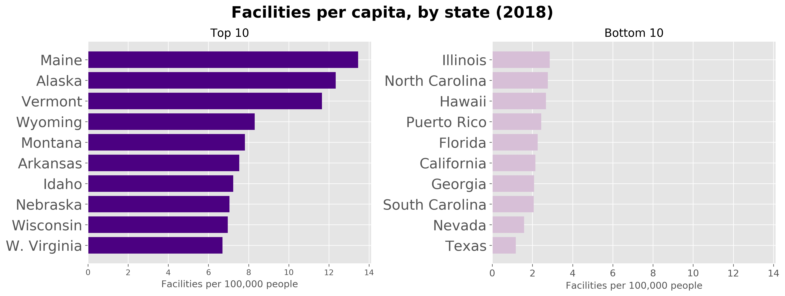
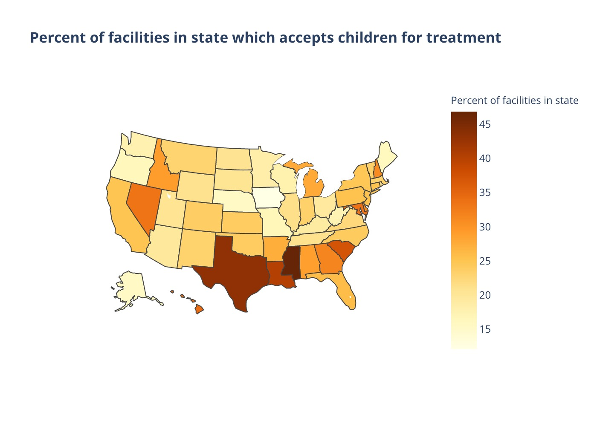
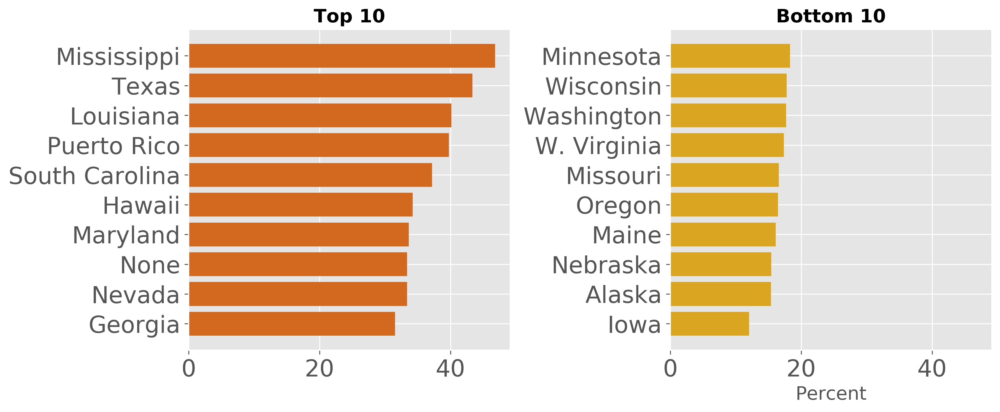
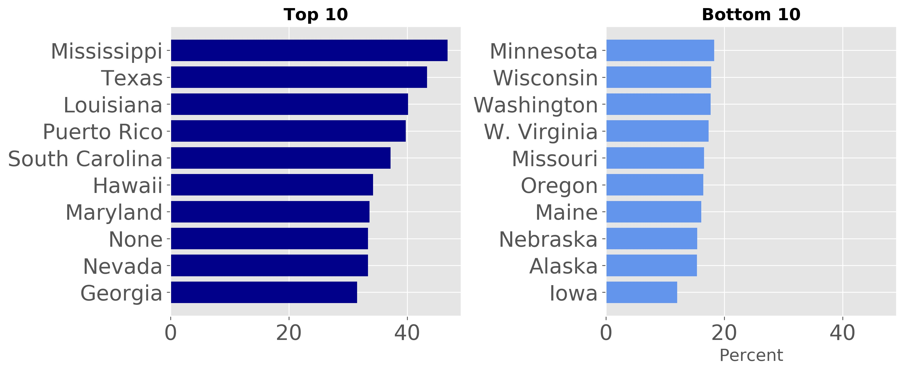
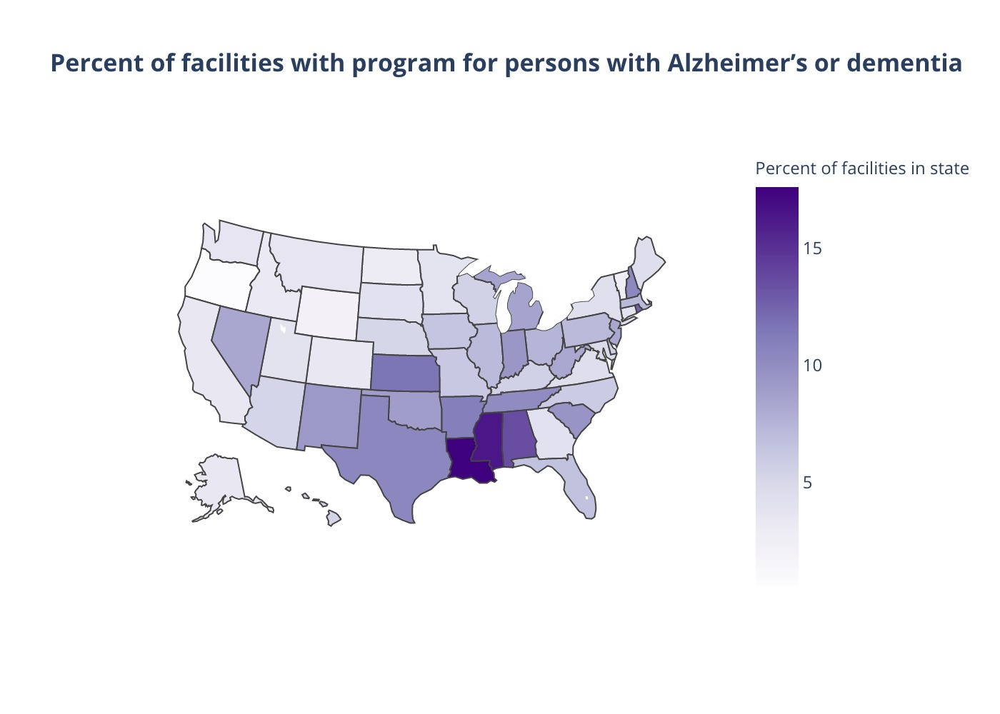
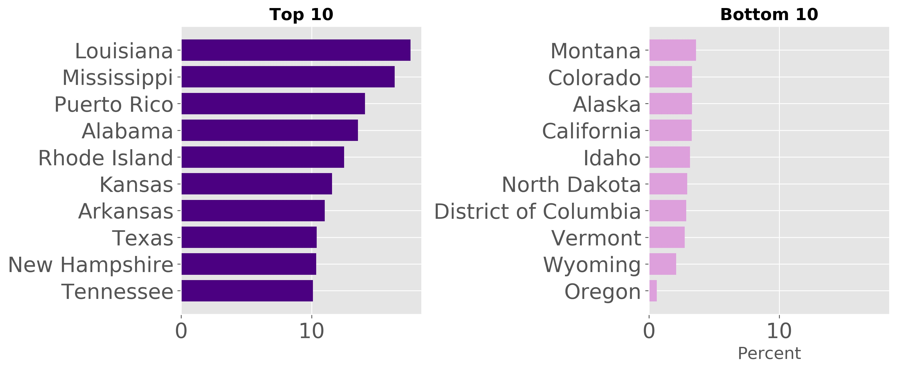
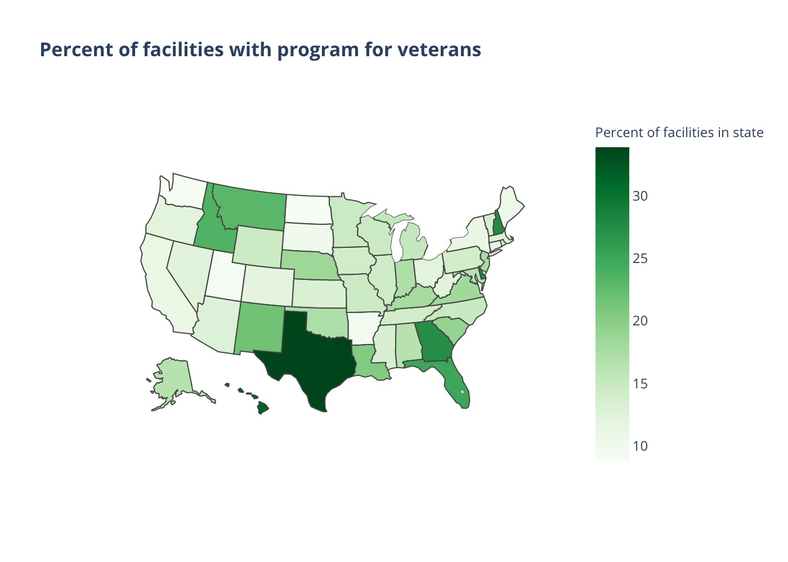
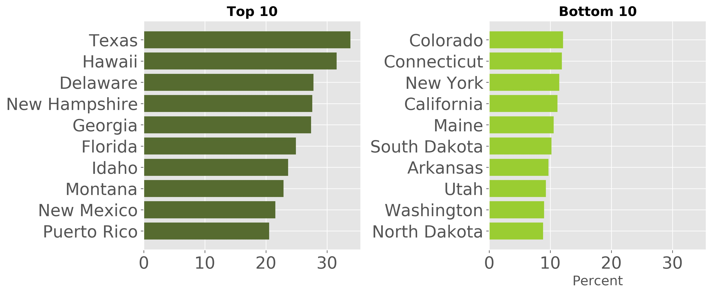
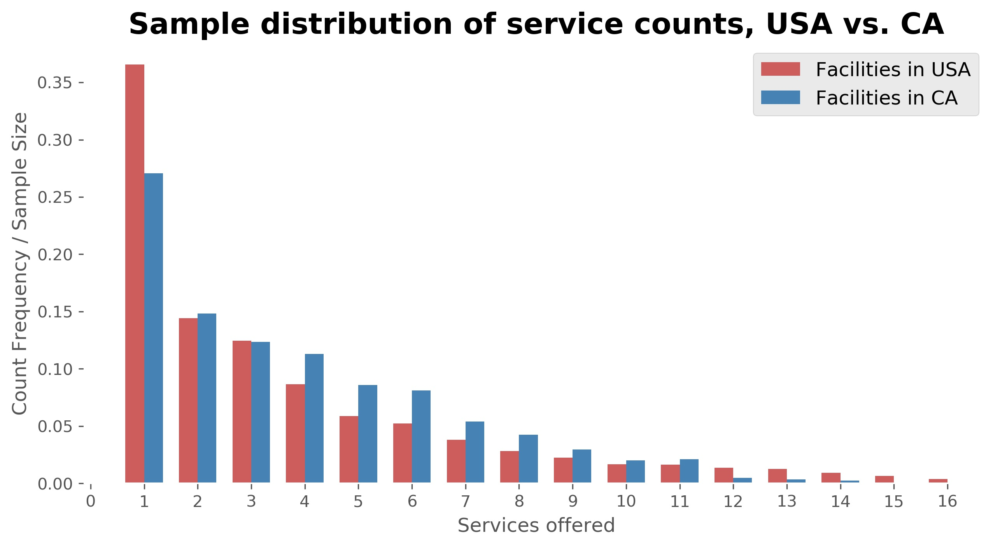

# US Mental Health Services for At-Risk Groups

### Project Overview
- An analysis of the services provided by mental health care facilities across the country, including a focus on California's provision of services to at-risk demographics.

### Motivation
- [Shortages](http://www.samhsa.gov/data/sites/default/files/cbhsq-reports/NMHSS-2018.pdf) of beds designated for mental health treatment in psychiatric and general hospitals 
- 
## EDA

 #### Data for this project comes from  [National Mental Health Services Surveys](https://www.datafiles.samhsa.gov/study-series/national-mental-health-services-survey-n-mhss-nid13521) (N-MHSS), and contains information about mental health treatment facilities in the United States.

- Original Datasets
    * 2010 - 2018, missing 2011 and 2013 (7 tables total)
    * 42,747 facilities (rows) with 284 features (columns)
- Data Cleaning
    * Correct for differences in the naming of same features over the years
    * After EDA, focused time range to 2018, the most recent dataset
    * Create "services count" column that sums number of facility services, remove invalid responses
- Cleaned Data
    * 11,679 facilities with 20 features

#### Focus on 2018 (most recent data)

Getting an overview of facility counts by state:

#### Populalation data was used from [census.gov](https://www.census.gov/newsroom/press-kits/2018/pop-estimates-national-state.html)

 we see some obvious similarities, as well as differences:

The linear correlation coefficient (r) between population and facility count as a function of state is 0.832893,
which is a relatively strong positive correlation.

Does the number of facilities in a state keep up with its population size? What are the statewide facility counts per capita?

States with lower [population density](https://en.wikipedia.org/wiki/List_of_states_and_territories_of_the_United_States_by_population_density), such as Maine(46th by population denisty), Alaska(50th), and Vermont(31st) score higher. Some states with many facilities, such as California and Florida, score in the bottom ten.

In 2018, 60% of facilities operated in an 'outpatient' setting.

## At-risk groups and treatment availability 

I am interested in the availability of services to at-risk groups, including children, the elderly, members of the LGBT community, and veterans. Continuing with a geographic approach

#### Children

#### Elderly

#### LGBT

#### Veterans

## Comparison of CA to USA

The 2018 [survey](https://nbviewer.jupyter.org/github/crunker99/U.S.-Mental-Health-Facilities/blob/master/data/NMHSS2018DS0001infoquestionnairespecs.pdf) asked each facility if they offered dedicated services for various demographics that could be considered at-risk groups, such as children/adolescents with serious emotional disturbances, persons with a diagnosis of PTSD, veterans, 

In the USA, the highest 'score' for count of services was 17. In CA, it was 14.
Looking across the mean score of all the facilities in each state:

Lowest mean score: Iowa - 2.58
Highest mean score: Hawaii - 5.0

Overall USA mean score: 3.64
CA mean score: 3.86

The distribution is right skewed:

California facilities scores slightly better, but is the 0.22 difference in average number of services offered?

## Hypothesis Test

>*H0*: There is no signficant difference between the mean number of services for at-risk groups offered at mental health treatment facilities in California and the rest of the country.

>P(# of services at facility in CA > # of services at facility elsewhere) = 0.5

Alternate hypothesis: The mean number of services offered at mental health treatment facilities in California is significantly greater than the rest of the country.

|# fac. in USA (excluding CA)|# of facilities in CA|
|:---:|:---:|
|10829|850|

Scale the frequency counts to the rate they occur in each sample.

### Outcome
As the data was not normally distributed, a Mann-Whitney U-statistic to test the validity of the null hypothesis within a confidence interval of 95%.

**P-value = 0.000000221**

As the P-value < 0.05, we may **reject** the null hypothesis within the accepted range of type 1 error, using the Mann-Whitney U-test. 

## Further Steps

Use other categorical variables besides state and examine their influence on what types of services facilities provide. 